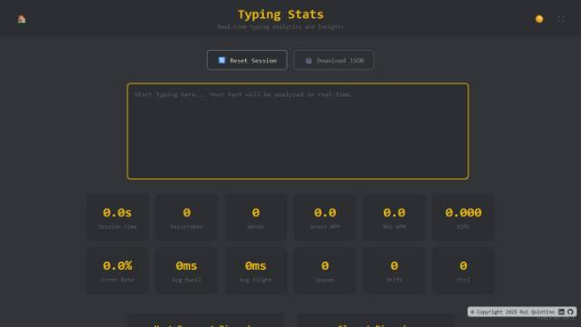

# Rui Quintino (with 🤖) Web Snippets Playground

[](https://github.com/rquintino/rqi-web-snippets/actions/workflows/test.yml)
[](https://rquintino.github.io/rqi-web-snippets/)
[](https://opensource.org/licenses/MIT)
[](https://github.com/rquintino/rqi-web-snippets/commits)

[](https://developer.mozilla.org/en-US/docs/Web/HTML)
[](https://developer.mozilla.org/en-US/docs/Web/JavaScript)
[](https://alpinejs.dev/)
[](https://playwright.dev/)

A collection of standalone web utilities and applications, each designed to be simple, safe and immediately usable without setup.

## Live Demo

**🌐 Access all tools online: [https://rquintino.github.io/rqi-web-snippets/](https://rquintino.github.io/rqi-web-snippets/)**

All assets and utilities in this repository are published and available online via GitHub Pages.

## 🤖 AI Coding Assistants Integration

This repository is optimized for AI coding assistants:

- **🐙 GitHub Copilot** - Instructions in `.github/copilot-instructions.md`
- **🧠 Claude Code** - Instructions in `CLAUDE.md`

These instructions help AI assistants understand the repository structure, coding conventions, and development guidelines.

## Features

- **Standalone Applications** - Each utility is a self-contained HTML/JS/CSS set in the `apps/` folder
- **No Setup Required** - Just open any HTML file in the `apps/` folder in a browser
- **Modern UI** - Dark/light mode and fullscreen toggles on all utilities
- **Automated Testing** - Playwright tests for each application
- **Privacy-Focused** - No data collection, only local storage when needed
- **Mobile Friendly** - Responsive design for all devices
- **🤖 AI Assistant Ready** - Optimized for GitHub Copilot 🐙 and Claude Code 🧠

## Available Utilities

### [Typing Speed Test](https://rquintino.github.io/rqi-web-snippets/apps/typing-speed-test.html)
Measure and improve your typing speed with real-time WPM calculation and word-by-word performance visualization


### [Typing Stats](https://rquintino.github.io/rqi-web-snippets/apps/typing-stats.html)
Advanced real-time typing analytics with deep insights into typing behavior, digraph analysis, dwell/flight times, and comprehensive metrics tracking



### [Markdown Viewer](https://rquintino.github.io/rqi-web-snippets/apps/markdown-viewer.html)
Three-pane markdown editor with live preview, table of contents, drag & drop file support, and HTML export


### [Foundation Model Training](https://rquintino.github.io/rqi-web-snippets/apps/foundation-model-training.html)
Interactive visualization of AI model training pipeline with animated GPU scaling and training simulation


### [How Does GenAI Learn?](https://rquintino.github.io/rqi-web-snippets/apps/how-does-genai-learn.html)
Interactive visualization demonstrating how language models learn through masked word prediction and next-word generation


### [How LLMs Work](https://rquintino.github.io/rqi-web-snippets/apps/how-llms-work.html)
Interactive visualization showing how Large Language Models process inputs to generate outputs with animated network connections and pattern nodes


### [What's New with GenAI](https://rquintino.github.io/rqi-web-snippets/apps/whats-new-with-genai.html)
Interactive comparison between Traditional AI and Generative AI with network animations, foundation model visualization, and dynamic capability showcase


## Usage

1. Simply clone the repository
2. Open any utility's HTML file in the `apps/` folder in a modern web browser
3. No build steps, no dependencies to install (except for playwright for tests)

Alternatively, you can access all utilities directly through the GitHub Pages site: [https://rquintino.github.io/rqi-web-snippets/](https://rquintino.github.io/rqi-web-snippets/)

## Development

Test suite is available with Playwright:

```bash
npm test             # Run all tests
npm run test:ui      # Run tests with UI
npm run test:debug   # Run tests in debug mode
```


## Author

Created by [RQuintino](https://www.linkedin.com/in/rquintino/) with the help of 🤖 AI assistants: GitHub Copilot 🐙 & Claude Code 🧠
